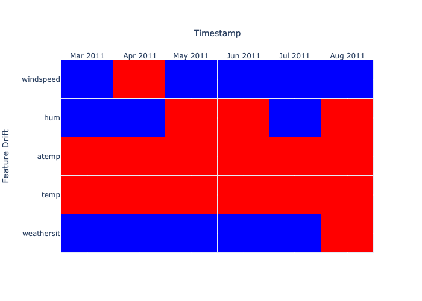
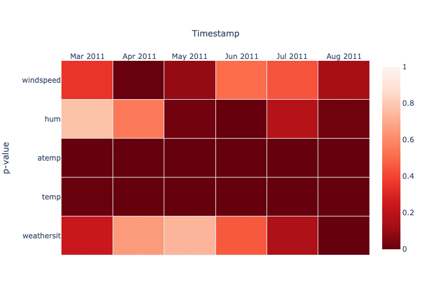
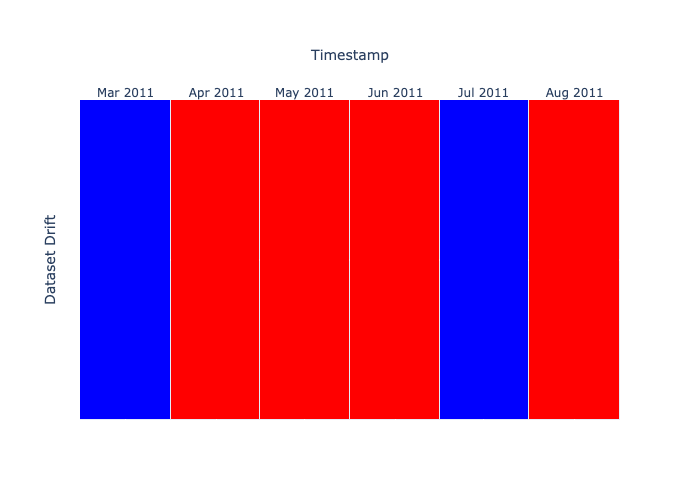
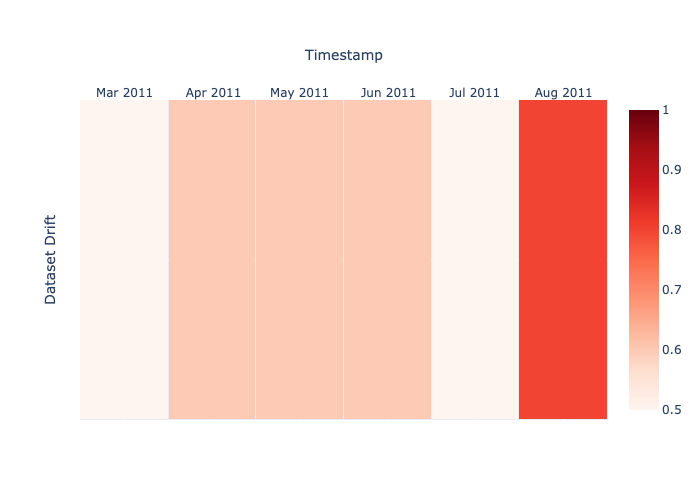
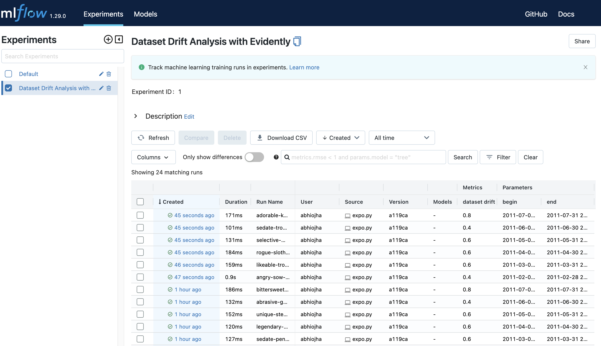
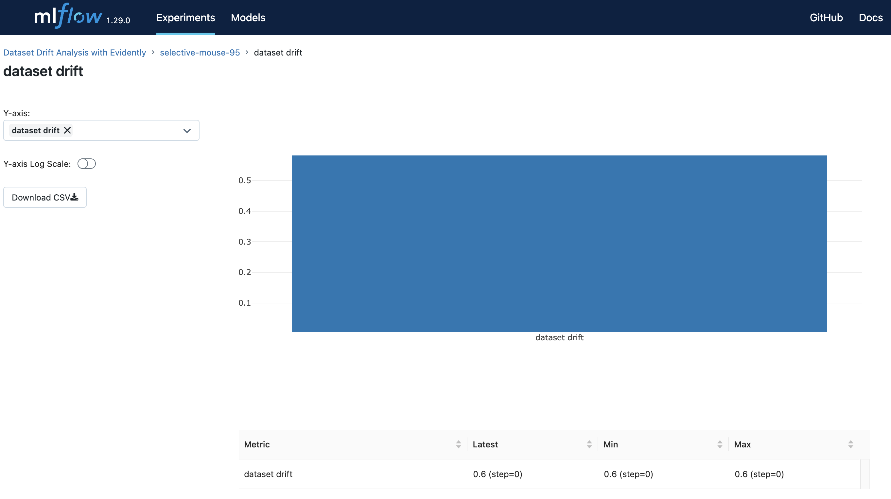
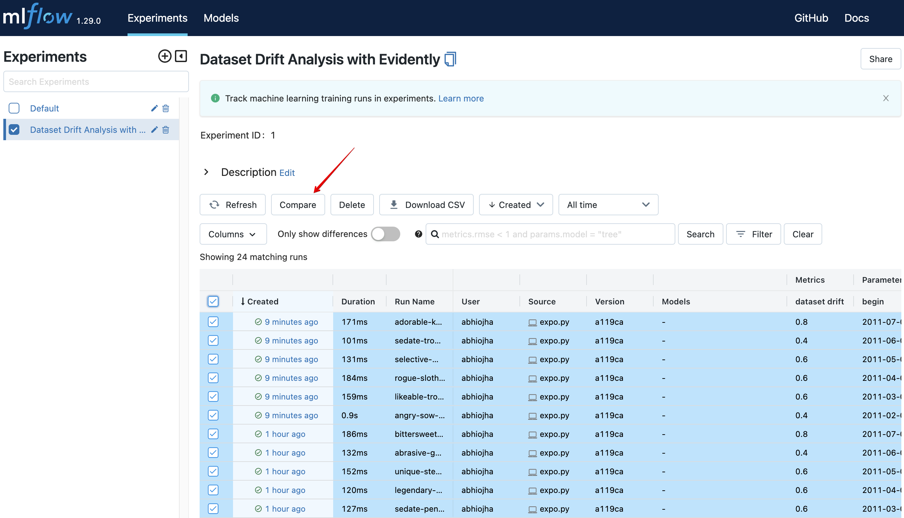
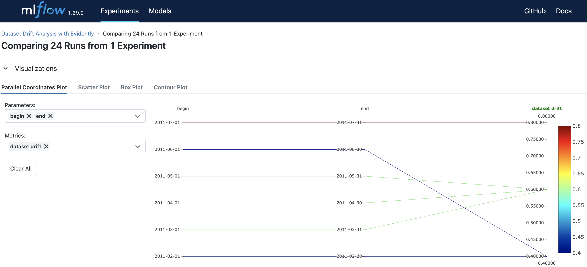

# Historical Data Drift

In this tutorial, we will calculate and visualize historical data drift, which tells us how data has changed. We have used the [UCI Bike Sharing dataset](https://archive.ics.uci.edu/ml/datasets/bike+sharing+dataset) for this tutorial.

### Steps to run
1. Clone this repository.
2. Install dependencies from the `requirements.txt` file.
3. The `expo.py` file contains the code to calculate data drift (the process is the same as the previous tutorial). You can run the file and setup an mlflow server as follows:
    ```bash
    python expo.py & mlflow ui
    ```

### What is expo.py?
It contains the code to calculate data and feature drift using **evidently**, generate visualizations using **plotly**, and log the results using **mlflow**. Most of this code (except plotly) should now seem familiar to you.

### Drift Results
1. **Feature Drift** - The drift is shown in red color in the image below. This does not look stable as there is a lot of drift. If you carefully observe this dataset, you would note that we have a use case with high seasonality. Our data is about weather and contains features like Temperature, Humidity, Wind Speed, etc., which can change a lot every month. This gives us a clear signal that we need to factor in the most recent data and update our model often.
    
    If we want to look at this drift more granuarly, we can plot the respective p-values as shown below:
    

2. **Dataset Drift** - Knowing how volatile the data is, we set a high threshold in `expo.py`. We only call it drift if 90% of the features have a statistical change in distributions. This is how the results look:
    
    We get a more granular view when we plot using the share of drifting features within each month
    

### Logging results in mlflow

We use **mlflow** for logging drifts. When we run the expo.py file together with mlflow, we can see the results in mlflow ui. To see the logs mlflow ui:
1. Navigate to the URL that is generated once you run the command 
    ```bash
    python expo.py & mlflow ui
    ```
    On selecting the **Dataset Drift Analysis with Evidently** experiment, you should see the logs as shown in the image below:
    
2. We can view the data drift for any run by selecting the run, navigating to **Metrics** and clicking on **dataset drift**.
    
3. We can also select multiple runs and compare the results:
    
    On comparison, you can generate a **Parallel Coordinates Plot** as shown below. There are options for **Scatter Plot**, **Box Plot** and **Contour Plot** as well.
    